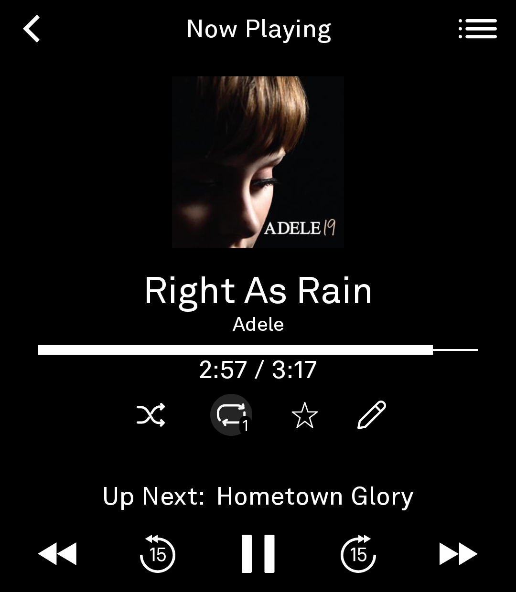
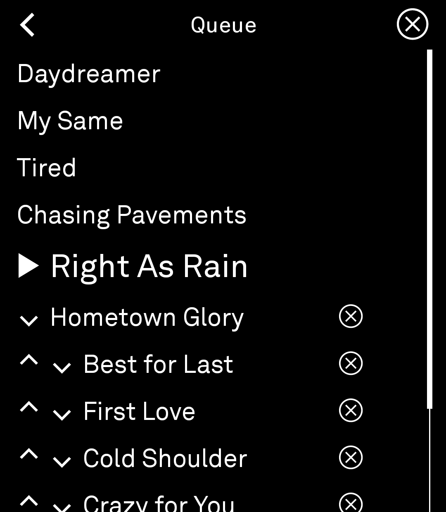
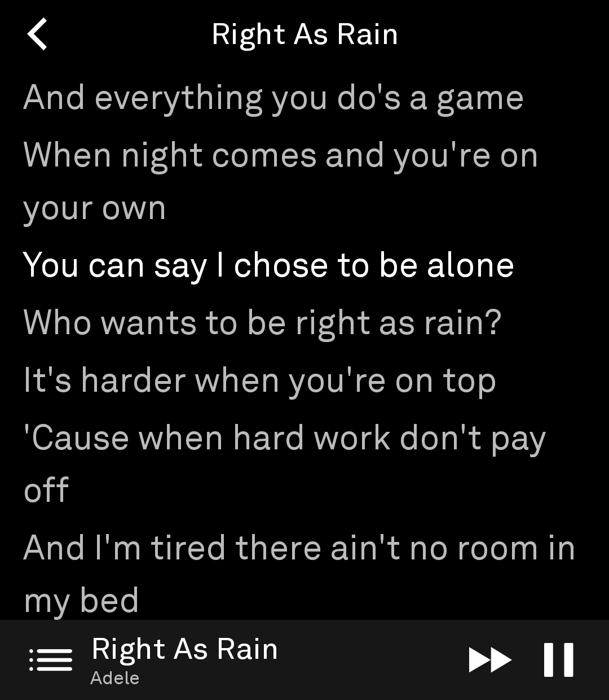
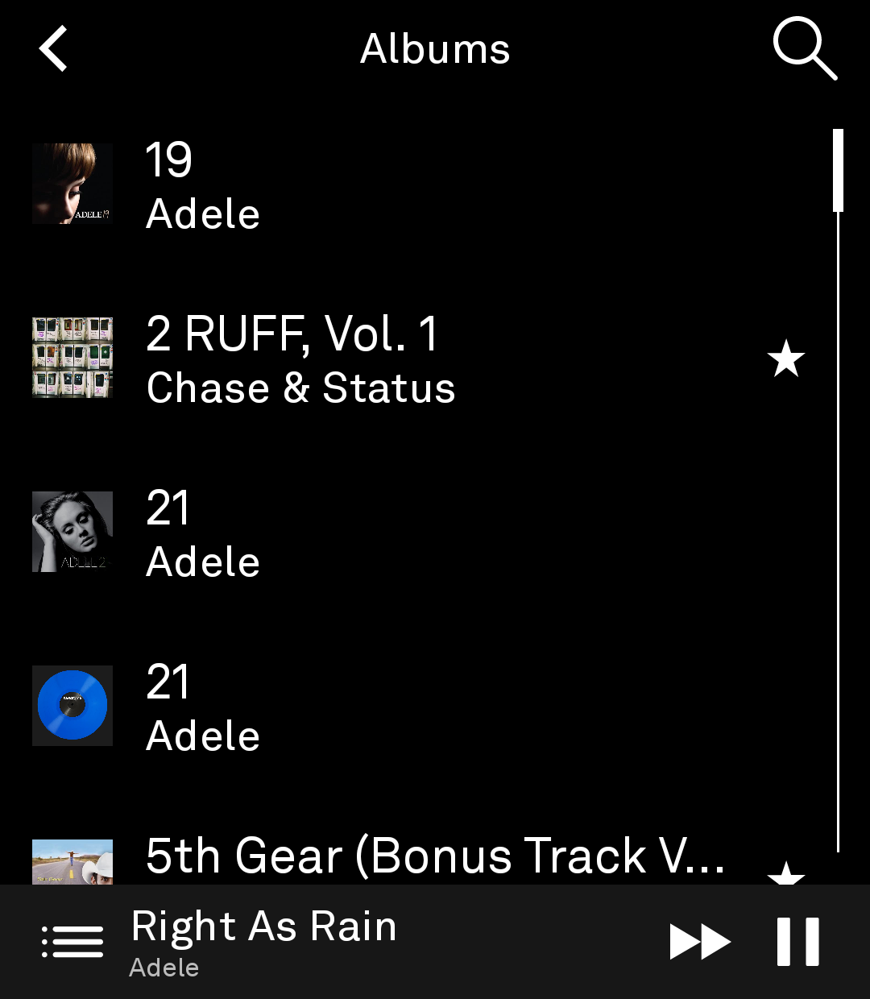
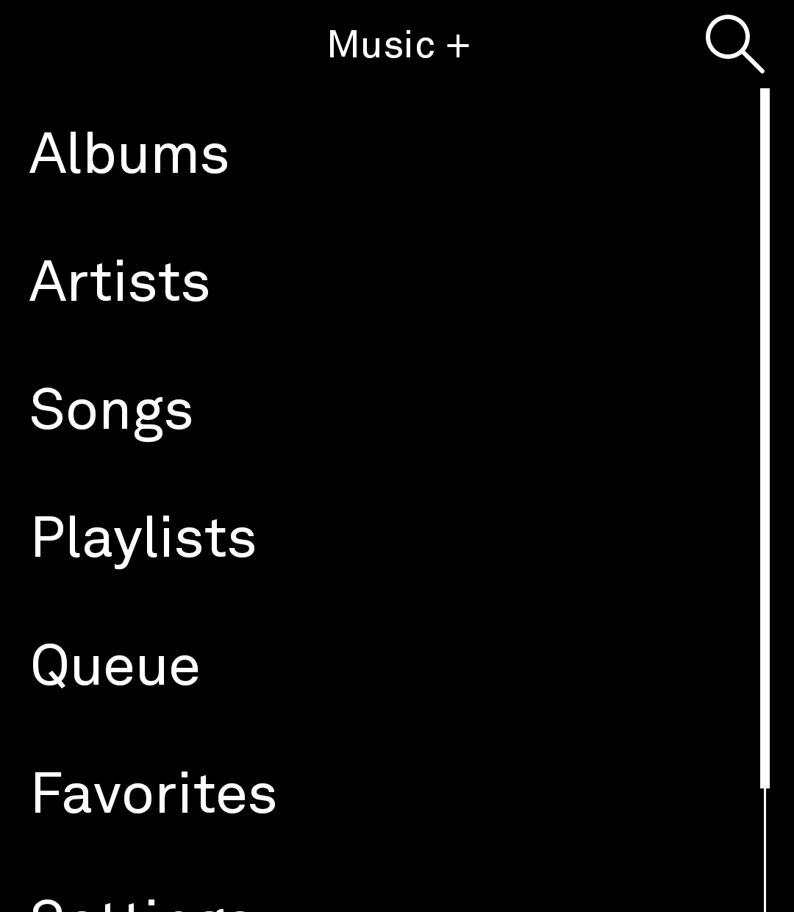
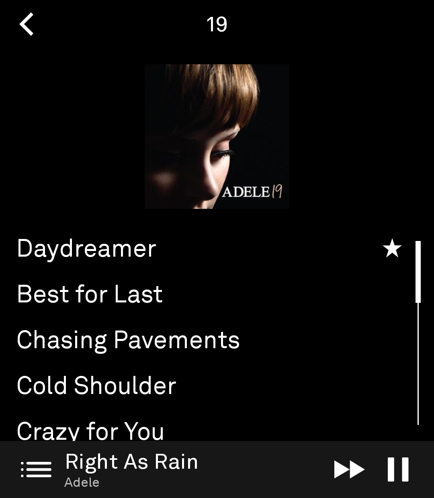
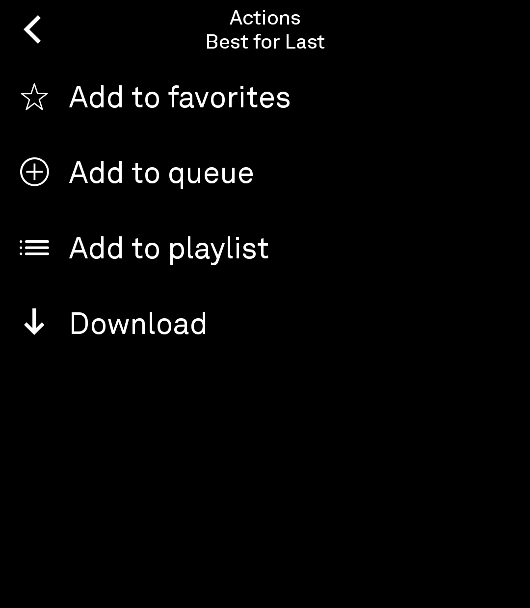

# Music +

A full-featured music player for the [Light Phone III](https://www.thelightphone.com/),
built on Light's own [Light SDK](https://github.com/lightphone/light-sdk), streaming
from a self-hosted [Navidrome](https://www.navidrome.org/) server (or any other
Subsonic-API-compatible server — Gonic, Airsonic, etc.).

**Fully offline-capable.** Download any song, album, or playlist for offline
listening. Favorites, playlist edits, and
everything else made while offline sync automatically the next time you're
connected.

<p float="left">
  
  
  
  
</p>

## Features

### Library

- Browse by **Albums**, **Artists**, or a flat **Songs** list covering every
  track in the library
- **Search** across artists, albums, and tracks
- **Favorites** — star/unstar artists, albums, and tracks independently, synced
  with the server
- **Playlists** — create, rename, delete, and reorder tracks
- **Download for offline use** — albums, playlists, and individual songs, via
  long-press
- Album art and lyrics automatically saved locally for offline use as you load them.

<p float="left">
  
  
</p>

### Long-press action menu

Long-press any track, album, or playlist for its actions: favorite, add to
queue, add to playlist, and download. Available from every list in the app —
Albums, Artists, Songs, Search, Favorites, and Playlists.

<p float="left">
  
</p>

### Playback

- Full transport controls — play/pause, ±15s skip, next/previous track
- Playback continues when you navigate away from Now Playing or the phone locks
- **Shuffle** reshuffles the whole queue, including already-played tracks —
  turning it back off restores the exact original order
- **Repeat** — off, repeat queue, or repeat one track (shuffle and repeat-one
  are mutually exclusive; repeat-queue and shuffle can run together)
- **The queue survives an app restart** — song order, current track, position,
  and shuffle/repeat mode are all restored
- **Queue screen** — the entire queue, with per-row reorder and remove, a
  "clear queue" action that leaves the current track playing, and tap-to-jump
  to any track
- **Lyrics** — synced and current line highlighted as it plays - tap on a line to jump to that part of the song

### Everywhere else

- A persistent mini-player
- Now Playing opens by tapping the mini-player
- Server connection is configurable in Settings, with support for saving more
  than one server
- Preferences: show/hide album artwork, haptic feedback

## How it's built

- Kotlin + Jetpack Compose + Coroutines + MVVM, per the Light SDK's own
  conventions — see `SETUP.md` for build details.
- Networking via [Ktor](https://ktor.io/) against the open Subsonic REST API
  (`src/.../data/Subsonic*.kt`) — works against any Subsonic-compatible server,
  not just Navidrome.
- Persistence via Room (library cache, favorites, download index, play queue,
  offline sync queue) and DataStore (server connection, preferences, playback
  resume state).
- Playback via the SDK's `LightAudio` detached-audio player — a single shared
  player instance for the app's lifetime (`PlaybackRepository` /
  `PlaybackRepositoryHolder`).

## Project layout

```
lighttool.toml                 tool manifest (id, permissions, capabilities)
build.gradle.kts               module build file (see SETUP.md — this repo is NOT
                                independently buildable, see below)
src/main/kotlin/com/musicplus/app/
  MusicPlusEntryPoint.kt        SDK entry point
  MusicPlusModels.kt            UI-facing domain models (Artist/Album/Track/...)
  MusicPlusScaffold.kt          shared top bar / mini-player / bottom bar shell
  HomeScreen.kt                 @InitialScreen — navigation hub
  PlayerScreen.kt                now playing / transport controls
  QueueScreen.kt                 full queue, reorder/remove/jump
  LyricsScreen.kt                synced/plain lyrics
  SearchScreen.kt, AlbumListScreen.kt, AlbumDetailScreen.kt,
  ArtistListScreen.kt, ArtistDetailScreen.kt, SongsListScreen.kt,
  FavoritesScreen.kt, PlaylistListScreen.kt, PlaylistDetailScreen.kt,
  PlaylistPickerScreen.kt        remaining library/browse screens
  ActionsMenuScreen.kt           shared long-press action menu
  SettingsScreen.kt, ServerSettingsScreen.kt, ServerEditScreen.kt,
  PreferencesScreen.kt           server config / app settings
  data/
    Subsonic{Client,Api,Dtos}.kt  Subsonic/Navidrome REST client
    ServerConfigRepository.kt     server URL/credentials (DataStore-backed)
    SubsonicApiHolder.kt          lazy API-client resolution
    Local{Entities,Daos}.kt,
    MusicPlusDatabase.kt          Room cache
    LibraryRepository.kt          cache-then-network library access
    PlaylistRepository.kt         playlist CRUD
    DownloadRepository.kt         download queue
    PlaybackRepository.kt         wraps the SDK's audio player
    PlaybackStateRepository.kt    persisted resume state (queue index/position/mode)
    LyricsRepository.kt           synced/plain lyrics fetch
    SyncQueueRepository.kt        offline write queue + retry
    AppGraph.kt                   composition root
```

## Building this

This module is **not** independently buildable — see `SETUP.md` for why (short
version: the Light SDK isn't published as a Maven artifact yet; a tool is built as
a module inside a clone of `lightphone/light-sdk`) and the exact steps to build,
run against the SDK's emulator, and sideload onto a real device.
